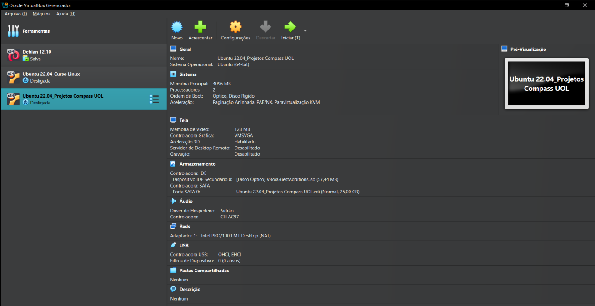
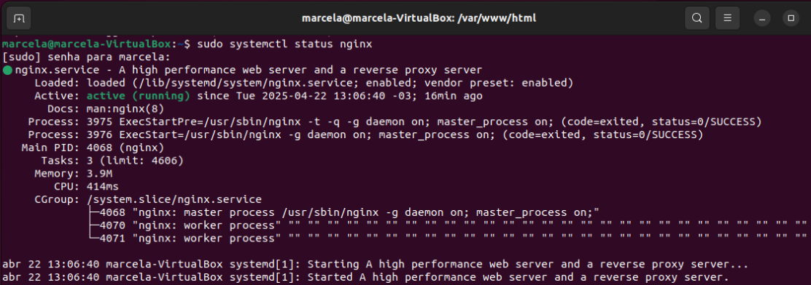
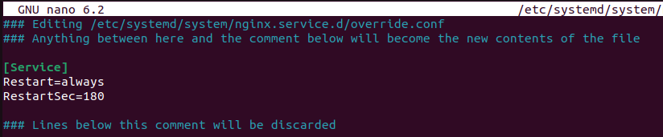
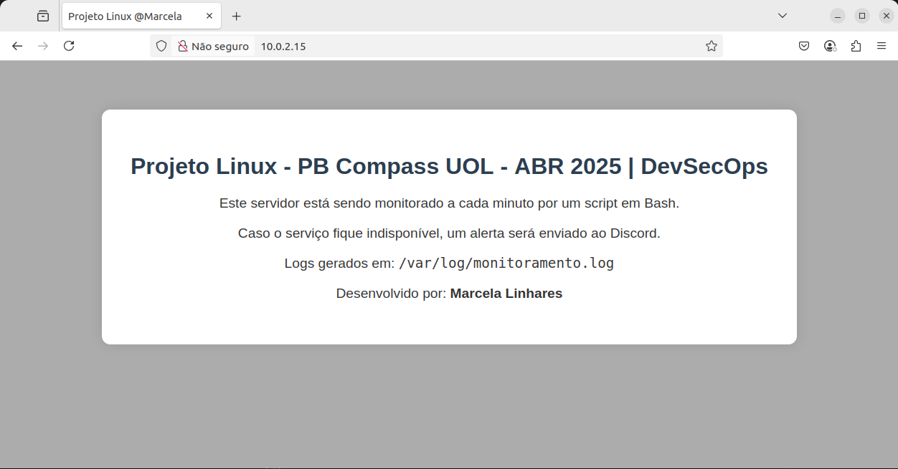
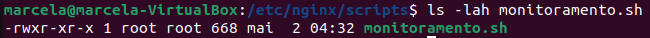
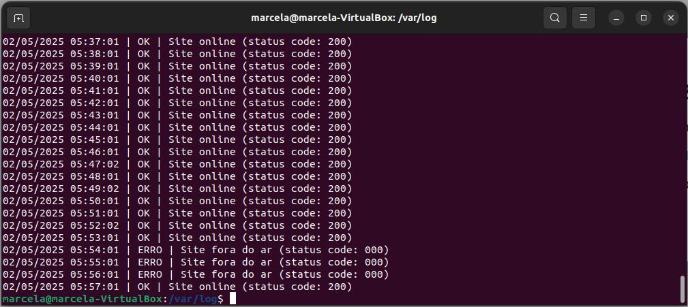
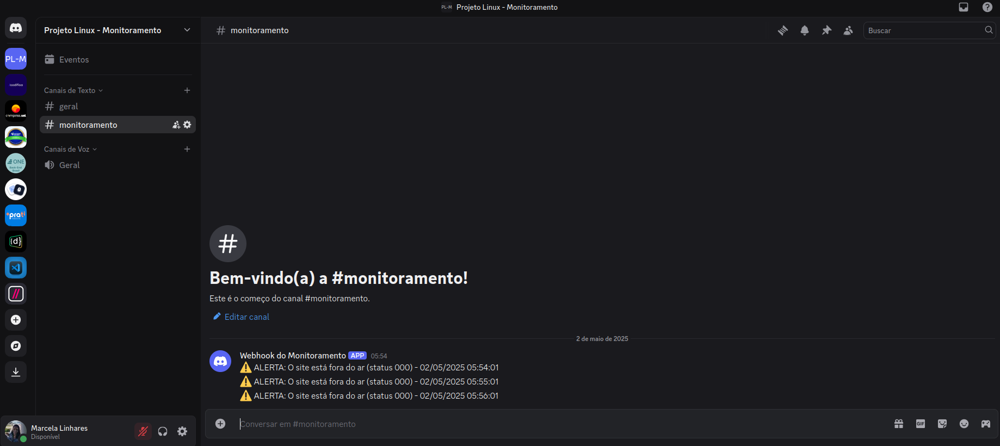

># Projeto Linux - PB Compass UOL - ABR 2025 | DevSecOps

# Resumo

Este projeto foi desenvolvido como parte da trilha de Linux no Programa de Bolsas da Compass UOL – Abril de 2025 | DevSecOps.

O objetivo principal é realizar a configuração de um servidor web local utilizando o Nginx em uma máquina virtual Ubuntu 22.04, criada no VirtualBox, e implementar um sistema de monitoramento automatizado da aplicação. O monitoramento é feito por meio de um script em Shell Script (Bash) que verifica periodicamente a disponibilidade do site e envia notificações via Webhook para um canal do Discord em caso de indisponibilidade. Além disso, os resultados são registrados com data, hora e status em um arquivo de log.

O projeto reforça habilidades práticas em Linux, automação com crontab, criação e gerenciamento de serviços web, e integração com sistemas de notificação.

# Tecnologias Utilizadas

<a href="https://ubuntu.com/" target="_blank">
  
</a>
<a href="https://www.virtualbox.org/" target="_blank">
  
</a>
<a href="https://www.nginx.com/" target="_blank">
  
</a>
<a href="https://www.gnu.org/software/bash/" target="_blank">
  
</a>
<a href="https://developer.mozilla.org/pt-BR/docs/Web/HTML" target="_blank">
  
</a>
<a href="https://discord.com/" target="_blank">
  
</a>
<a href="https://man7.org/linux/man-pages/man5/crontab.5.html" target="_blank">
  
</a>
<a href="https://git-scm.com/" target="_blank">
  
</a>
<a href="https://github.com/" target="_blank">
  
</a>

# Etapas

- [Etapa 1 - Configuração do Ambiente](#etapa-1---configuração-do-ambiente)

- [Etapa 2 - Instalação e Configuração do Servidor Web](#etapa-2---instalação-e-configuração-do-servidor-web)

- [Etapa 3 - Script de Monitoramento e Webhook](#etapa-3---script-de-monitoramento-e-webhook)

- [Etapa 4 - Teste e Validação da Solução](#etapa-4---teste-e-validação-da-solução)

- [Etapa Final - Conclusão](#etapa-final---conclusão)

# Etapa 1 - Configuração do Ambiente

O ambiente de desenvolvimento foi configurado em uma máquina virtual com Ubuntu 22.04 LTS, utilizando o Oracle VirtualBox como hypervisor. A VM será usada como servidor local para a instalação e execução do projeto.

### ⚙️ Principais configurações:
- Sistema: Ubuntu 22.04 LTS (64-bit)
- Memória RAM: 4 GB
- Processadores: 2 CPUs
- Armazenamento: 25 GB (dinamicamente alocado)

### 💻 Print da máquina virtual configurada:



# Etapa 2 - Instalação e Configuração do Servidor Web

Nessa etapa foi instalado e configurado o servidor web **Nginx** na máquina virtual Ubuntu 22.04. Também foi criada uma página HTML personalizada para ser servida pelo Nginx, contendo informações sobre o projeto. E foi criado um serviço systemd para garantir que o Nginx reinicie automaticamente após 3 minutos se parar.

## 1. Instalação e verificação do Nginx

### 1.1. Atualização dos pacotes do sistema

```bash
sudo apt update
```

### 1.2. Instalação do Nginx

```bash
sudo apt install nginx -y
```

### 1.3. Após a instalação, o serviço é iniciado automaticamente. O status pode ser verificado com:

```bash
sudo systemctl status nginx
```

### 1.4. Print da saída do comando 1.3 mostrando que o servidor encontra-se ativo:



## 2. Criação da página HTML personalizada

### 2.1. A página foi criada no diretório padrão `/var/www/html` com o nome `index.projetolinux.html`:

```bash
sudo nano /var/www/html/index.projetolinux.html
```

Uma cópia do arquivo também está disponível no repositório: `PROJETO-LINUX_COMPASS-UOL/index.projetolinux.html`

## 3. Configuração do Nginx para servir a página correta

### 3.1. Foi necessário editar o arquivo de configuração padrão do Nginx:

```bash
sudo nano /etc/nginx/sites-available/default
```

### 3.2. Na seção `server`, a linha de configuração foi alterada para indicar o arquivo HTML personalizado:

```nginx
index index.projetolinux.html;
```

### 3.3. Após a modificação, o serviço foi reiniciado:

```bash
sudo systemctl restart nginx
```

## 4. Configuração do systemd para reinício automático do Nginx

### 4.1. Para garantir que o Nginx reinicie automaticamente em caso de falha, foi criada uma sobrescrita do serviço via `systemd`:

```bash
sudo systemctl edit nginx
```

### 4.2. E adicionado o seguinte conteúdo para reiniciar após 3 minutos:

Para garantir que o script consiga identificar uma falha antes que o Nginx volte a funcionar, foi configurado o `systemd` para aguardar 3 minutos (180 segundos) antes de reiniciar o serviço:

```ini
[Service]
Restart=always
RestartSec=180
```



Isso garante que falhas reais com mais de 1 minuto de duração sejam detectadas e registradas pelo script de monitoramento.

### 4.3. Após salvar, o systemd foi recarregado e o serviço reiniciado:

```bash
sudo systemctl daemon-reexec
sudo systemctl restart nginx
```

### 4.4. Print da página exibida no navegador:



# Etapa 3 - Script de Monitoramento e Webhook

Nessa etapa foi criado um script em Bash que monitora se o site hospedado no servidor Nginx está disponível. O script é executado a cada 1 minuto usando o agendador `crontab`. Caso o site esteja fora do ar, o script envia uma notificação via webhook para um canal no Discord e registra os eventos em um arquivo de log.

## 1. Script de monitoramento

### 1.1. Criação do script

O script foi criado no diretório `/var/www/html/scripts/` com o nome `monitoramento.sh`, e o seguinte comando:

```bash
sudo nano monitoramento.sh
```

```bash
!/bin/bash

URL="http://10.0.2.15"
WEBHOOK="MEU_WEBHOOK_DO_DISCORD_AQUI"
LOG="/var/log/monitoramento.log"
STATUS=$(curl -s -o /dev/null -w "%{http_code}" $URL)
DATAHORA=$(date "+%d/%m/%Y %H:%M:%S")

if [ "$STATUS" -ne 200 ]; then
    echo "$DATAHORA | ERRO | Site fora do ar (status code: $STATUS)" >> $LOG
    curl -H "Content-Type: application/json" \
         -X POST \
         -d "{\"content\": \"⚠️ ALERTA: O site está fora do ar (status $STATUS) - $DATAHORA\"}" \
         $WEBHOOK
else
    echo "$DATAHORA | OK | Site online (status code: $STATUS)" >> $LOG
fi
```

Uma cópia do arquivo também está disponível no repositório: `PROJETO-LINUX_COMPASS-UOL/monitoramento.sh`

### 1.2. Explicação do script por partes

`#!/bin/bash` - Define o interpretador do script como Bash.

`URL="http://10.0.2.15"` - Define o endereço IP da aplicação a ser monitorado.

`WEBHOOK="MEU_WEBHOOK_DO_DISCORD_AQUI"` - Armazena o URL do webhook do Discord, que será usado para enviar notificações.

`LOG="/var/log/monitoramento.log"` - Define o caminho do arquivo de log que armazenará os registros de execução.

`STATUS=$(curl -s -o /dev/null -w "%{http_code}" $URL)` - Usa o `curl` para fazer uma requisição ao site e armazena o código HTTP de resposta. O `-s` silencia a saída, `-o /dev/null` descarta o conteúdo da resposta e `-w` extrai apenas o status.

`DATAHORA=$(date "+%d/%m/%Y %H:%M:%S")` - Gera a data e hora atuais no formato brasileiro para os registros.

`if [ "$STATUS" -ne 200 ]; then` - Verifica se o código de status é diferente de 200 (erro).

`echo "$DATAHORA | ERRO | Site fora do ar (status code: $STATUS)" >> $LOG` - Registra o erro com data, hora e código HTTP no log.

```
curl -H "Content-Type: application/json" \
         -X POST \
         -d "{\"content\": \"⚠️ ALERTA: O site está fora do ar (status $STATUS) - $DATAHORA\"}" \
         $WEBHOOK
```       
\- Envia uma notificação com alerta para o Discord via webhook.

```
else
    echo "$DATAHORA | OK | Site online (status code: $STATUS)" >> $LOG
fi
```
\- Se o site estiver no ar (status 200), registra um log com status "OK".

### 1.3. Permissão de execução do script:

```bash
chmod +x scripts/monitoramento.sh
```



## 2. Agendamento com crontab

### 2.1. O script foi configurado para ser executado automaticamente a cada 1 minuto com o `crontab`. Para isso, foi usado o seguinte comando:

```bash
sudo crontab -e
```

### 2.2. E adicionada a linha:

```bash
* * * * * /etc/nginx/scripts/monitoramento.sh
```

Os asterísticos da linha no `crontab` representam, nesta ordem: **minuto**, **hora**, **dia do mês**, **mês** e **dia da semana**. Em seguida, vem o caminho completo do script e nome do arquivo que será executado no horário definido.

## 3. Permissões e criação do log

### 3.1. O arquivo de log foi criado no diretório `/var/log/` com o nome `monitoramento.log`. Esse arquivo armazena os registros das execuções do script, contendo data, hora e o status da aplicação.

```bash
sudo touch /var/log/monitoramento.log
sudo chmod 644 /var/log/monitoramento.log
```

A permissão `644` garante que o root (usuário que roda o script via `crontab`) possa escrever no arquivo, enquanto outros usuários têm apenas permissão de leitura.

## 4. Configuração do Webhook no Discord

### 4.1. Para que o script envie alertas, foi configurado um **webhook** no Discord seguindo os passos:

1. Criado um servidor no Discord exclusivo para o projeto.
2. Criado um canal de texto chamado `#monitoramento`.
3. No canal, acessado **Configurações > Integrações > Webhooks**.
4. Clicado em **"Novo Webhook"**, escolhido o nome e canal, e clicado em **"Copiar URL do Webhook"**.
5. Essa URL foi inserida dentro do script, na variável `WEBHOOK`.

# Etapa 4 - Teste e Validação da Solução

Nesta etapa, foram realizados testes para garantir que o sistema de monitoramento estivesse funcionando corretamente, tanto para situações normais quanto para falhas simuladas no servidor.

## 1. Teste com o servidor online

### 1.1. Com o Nginx ativo, o script registrou corretamente no log que o site estava acessível:

```bash
02/05/2025 05:57:01 | OK | Site online (status code: 200)
```

Mensagens com status **"OK"** foram geradas a cada minuto e armazenadas no arquivo `/var/log/monitoramento.log`.



## 2. Teste com o servidor offline

### 2.1. Para simular uma falha real, o processo do Nginx foi finalizado com o comando:

```bash
sudo pkill nginx
```

O comando `sudo pkill nginx` **simula uma falha inesperada no serviço**, como se o processo fosse finalizado abruptamente por erro do sistema.
Já o comando `sudo systemctl stop nginx` é interpretado como uma parada intencional e, por padrão, o `systemd` **não reinicia serviços que foram parados manualmente**.
Portanto, para testar o comportamento de reinício automático e registrar corretamente a indisponibilidade no log, é essencial usar `pkill`, que representa uma situação de falha real.

### 2.2. Como o serviço foi interrompido de forma inesperada, o systemd aguardou 3 minutos antes de reiniciá-lo (conforme configurado), permitindo que o script registrasse a falha:

```bash
02/05/2025 05:54:01 | ERRO | Site fora do ar (status code: 000)
02/05/2025 05:55:01 | ERRO | Site fora do ar (status code: 000)
02/05/2025 05:56:01 | ERRO | Site fora do ar (status code: 000)
```

O código `000` retornado pelo `curl` indica que o site não respondeu à requisição HTTP — ou seja, o servidor estava realmente fora do ar.

## 3. A notificação de alerta foi enviada com sucesso ao canal do Discord, informando o status da falha.



# Etapa Final - Conclusão

Com a realização dos testes e a validação da automação, foi possível confirmar que todos os objetivos do projeto foram alcançados com sucesso. A aplicação se manteve estável, o monitoramento funcionou como esperado e as notificações foram entregues corretamente ao Discord.

A seguir, algumas referências que auxiliaram na construção do projeto:

- Curso Udemy: [Primeiros Passos no Linux – Conceitos e Comandos Essenciais](https://www.udemy.com/course/primeiros-passos-no-linux/)

- Vídeo YouTube: [COMO INSTALAR O NGINX NO LINUX UBUNTU|SERVIDOR HTTP - Canal Expertos Tech](https://www.youtube.com/watch?v=Mgb9zHuwins)

- Vídeo YouTube: [Curso de Shell Script para iniciantes - Canal Diolinux](https://youtube.com/playlist?list=PLZsjaJhVZaxVAPf2cWffeP4ahpK65Tem0)

# 👩‍💻 Desenvolvido por:

<table>
  <tr>
    <td align="center">
      <a href="https://github.com/MarcelaLinhares">
        <br />
        <sub><b>Marcela Linhares</b></sub>
      </a>
    </td>
  </tr>
</table>